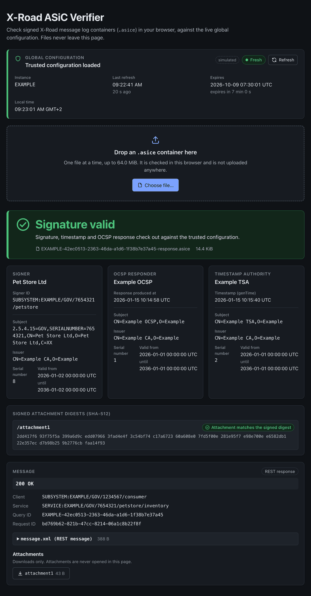

# X-Road ASiC Verifier

Drag an X-Road messagelog container (`.asice`) into the page and the browser verifies it against the X-Road instance's **global configuration**, not the EU Trusted List. It is a TypeScript port of X-Road's `asicverifier` CLI, at parity with **version 7.8.3** (same verdict, same fault code, same extracted details). Verification runs entirely in the browser, so containers never leave the user's machine.



## Quick start

Requires Node ≥ 24 and pnpm (via corepack). Docker is needed for the container image.

```sh
pnpm install
pnpm dev               # Vite dev server; serves /anchor.xml and proxies /globalconf/* to the central server
pnpm test              # unit tests
pnpm typecheck         # all workspaces
```

For dev, point the app at your X-Road instance:

```sh
ANCHOR_PATH="$PWD/anchor.xml" GLOBALCONF_UPSTREAM=https://cs.example.org/internalconf pnpm dev
```

`ANCHOR_PATH` is the instance's internal configuration anchor (on a security server: `/etc/xroad/configuration-anchor.xml`); use an absolute path, since Vite runs in `apps/web/`. `GLOBALCONF_UPSTREAM` is its central server's `downloadURL` (only the origin is used). The defaults are the placeholder `docker/anchor.example.xml` and `https://cs.example.org`, which let the app start but load no configuration.

Container image (static build behind unprivileged nginx with a same-origin globalconf proxy):

```sh
pnpm docker:build
docker run --rm -p 8080:80 \
  -v ./anchor.xml:/etc/verifier/anchor.xml:ro xroad-asic-verifier   # http://localhost:8080
```

The anchor is the only input. The entrypoint derives the upstream central server from it. See [docker/README.md](docker/README.md).

## Repository layout

| Path | What |
|---|---|
| `packages/verifier/` | `@xrav/verifier`: the verification core (TS source, no build step). Public API in `src/index.ts` |
| `packages/verifier/src/` | One directory per stage. `container` (zip + limits), `xml` / `c14n` (safe parsing, Santuario-exact C14N), `header` (SOAP/REST, signer derivation), `hashchain`, `xades`, `timestamp`, `trust` (X.509, X.500, crypto), `certpath`, `ocsp`, `binding`, `result`, `globalconf` (anchor → signed directory → shared-params → TrustContext, poller), `util`. `verify.ts` is the pipeline |
| `apps/web/` | Svelte UI (drop zone, verdict, header, message, attachments, globalconf status) |
| `docker/` | Dockerfile, nginx templates, entrypoint, example anchor |
| `docs/architecture.md` | How the verifier works: trust model, global configuration, verification pipeline, known deviations |

## Testing

- `pnpm test` runs the unit tests: synthetic containers, signatures, certificates and OCSP responses for each stage, plus global configuration vectors derived from X-Road 7.8.3's own system-test fixture (instance `DEV`, `packages/verifier/test/globalconf/vectors/`).
- Parity with the 7.8.3 jar was established by running the real `asicverifier` classes and this port over the same containers (real messagelog containers plus tampered variants) and comparing results: successes deep-equal, failures with the same fault code, and byte-equal C14N. That container set is not part of this repository.

## Known deviations

- **Fault-string wording.** The fault **code** always matches. Some fault *strings* differ in wording only: a missing `[<uuid>] [SYSTEM]` prefix, NPE text, the `xades:` element prefix, and an ASN.1 parser message. See [docs/architecture.md](docs/architecture.md#known-deviations-from-the-jar).
- **Algorithms WebCrypto lacks.** Digests other than SHA-1/256/384/512 (MD5, SHA-224, SHA-3) give `internal_error`. Signature methods other than RSA PKCS#1 v1.5, RSA-PSS and ECDSA P-256/384/521 (DSA, EdDSA…) give `malformed_signature` at load. The jar might accept some of these. RSA-PSS and ECDSA are implemented but were not exercised against the jar. Unsupported XML-DSig features (Transforms, exclusive C14N) are likewise not implemented.
- **Tampered attachment under a batch signature.** This gives `ok: true` with that attachment marked `verified: false`, exactly as the jar does. This is parity, not a bug; the UI flags such attachments. A `verified: false` line can also mean the attachment simply isn't in the container.

## Further reading

- [docs/architecture.md](docs/architecture.md)
- Module notes: `packages/verifier/src/*/README.md`, [xades/SANTUARIO-RULES.md](packages/verifier/src/xades/SANTUARIO-RULES.md)

## License

[MIT](LICENSE).

## Acknowledgements

This is a port of [X-Road](https://github.com/nordic-institute/X-Road) code (MIT License, © Nordic Institute for Interoperability Solutions). The test vectors in `packages/verifier/test/globalconf/vectors/xroad-fixture/` are copied from X-Road's system tests; see the `NOTICE.md` there.
